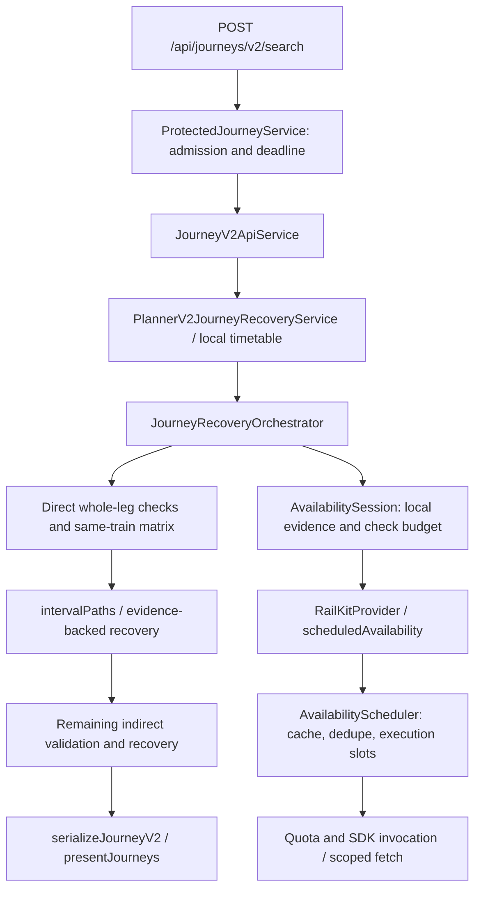

# Availability engine: durable architecture and audit

Audit date: 2026-09-23. Scope: the current working tree, including the existing uncommitted direct-matrix implementation. The original audit added only this document. The Phase 1 implementation update below records subsequent code changes.

## Read this before changing availability discovery

This is both a record of **current behavior** and the **required target design**. Sections labelled target/proposed are not claims that the feature already exists. **Phase 1 is now implemented:** per-search provider admission/accounting and the configurable maximum of 300. **Phase 2A is now implemented:** a separate SQLite latest-observation store and centralized configurable freshness contract. **Phase 2B is now implemented:** optional Redis distributed evidence caching. **Phase 3 is now implemented:** per-candidate EXACT_MATRIX/ADAPTIVE_GRAPH scheduling, whole-leg breadth and bounded gap refinement. Distributed singleflight and background refresh remain **not implemented**. The original audit sections below are historical baseline findings where the Phase 1, Phase 2A, Phase 2B and Phase 3 updates explicitly supersede them.

The target production policy is **at most 300 actual uncached availability provider requests per user search**, shared across all trains and search stages. The executable now independently enforces that provider ceiling. The earlier 32,768-search / 8,192-candidate limits remain as defensive logical-check ceilings, not provider-call allowances; Phase 3 retains them only as emergency logical-work bounds.

Future sessions must read this document, inspect the current working tree and tests, and preserve working behavior before proposing implementation. Do not remove the old allocator, normalizers, provider scheduler or path solver merely because an architectural replacement is planned. Make one reviewable migration phase at a time. Keep public inventory truth unchanged. No live provider verification, commits, pushes or deployment unless separately authorized.

Existing docs were read first: [README](../README.md), [direct matrix policy](direct-matrix-search.md), [cleanup manifest](cleanup-manifest.md), and [presentation notes](../src/journey/presentation/README.md). The direct-matrix policy describes the current intermediate implementation, not the new target. Some older README paragraphs still say 12/30/40 for V2, and the presentation README still describes status-first ranking. Those statements conflict with the audited code; do not copy them into a replacement design. They were not edited during this documentation-only audit.

## Implemented Phase 1: global provider admission

The scope is provider-cost accounting only. Route ordering, matrix/progressive selection, class selection, path solving, ranking, cache TTLs and public inventory truth are unchanged. A cold matrix can stop earlier under the new cap; Phase 1 does not promise route-wide fairness or adaptive search quality.

- **Configuration:** JOURNEY_AVAILABILITY_PROVIDER_CALL_LIMIT defaults to 300 and accepts only safe integers 1..300 through hardeningConfig. Missing/blank uses the safe default; malformed, fractional, zero, negative, infinite or greater-than-300 values fail validation. Internal overrides use the same bounds. Protected V2 passes its configured limit; the standalone V2 service and journey CLI also create one bounded search budget.
- **Lifetime:** JourneyRecoveryOrchestrator creates one AvailabilityProviderBudget and passes it to the single AvailabilitySession shared by whole-leg, same-train/mixed-class/gap recovery and indirect work. Phase/candidate allowances never reset it. AsyncLocalStorage propagates this object through provider calls; scheduler waiter snapshots restore the actual executing owner's budget. Independent searches have independent objects.
- **Exact boundary:** scheduledAvailability calls invokeAvailabilityProvider inside the scheduler's executing-owner callback, after input/configuration validation, shared inventory/unsupported cache lookup, inflight deduplication and cancellation checks, immediately before getAvailability in the RailKit SDK. The initial admitted SDK availability request counts even if its invocation throws. No debit occurs at the API wrapper for RailKit.
- **Additional attempts:** the scoped fetch hook in availability-abort.ts associates the first fetch with that already-admitted SDK request. Each subsequent fetch by that invocation, including an SDK retry, needs a new search/process-quota admission. No SDK/fetch is invoked after its admission is refused. actualSdkInvocations remains distinct: it does not include additional fetch attempts. The counter describes admitted outbound availability attempts, not provider receipt, billing, or a proof of wire traffic when an SDK throws before fetch.
- **Atomic admission:** acquire synchronously reserves one unit before calling the existing process-quota admission, with no await. If quota admission fails, the search reservation rolls back; if the search limit denies first, process quota is untouched. Once invocation begins, success/failure never refunds the attempt. Concurrent workers therefore cannot exceed the search limit, including when exactly one slot remains.
- **Cache/dedupe:** search-local completed/pending reuse, fresh shared inventory and unsupported evidence hits, and shared inflight followers spend zero additional provider allowance. The active executing owner is charged once; queued cancellation transfers ownership before dispatch, never after a request has started. Shared lookup/join precedes admission even at zero remaining provider allowance. The existing 15-second inventory cache, unsupported TTL, queue concurrency, quotas, abort behavior and no-late-publication rules remain.
- **Controlled exhaustion:** ProviderCallBudgetExhausted has the structural category PROVIDER_BUDGET_EXHAUSTED, propagated through the existing failure/normalization path. It is unknown/error evidence, never WAITLIST/NOT_AVAILABLE or reusable shared inventory. Once a fresh miss is denied, the session stops new exploration via its effective allowance, avoiding thousands of repeated denials. Already collected local evidence still works and the path solver retains partial reserved segments; uncovered distance remains unknown. The configured logical remaining count is reported separately from this stop condition. A result can still be FULL when a continuous valid path was already obtained.
- **Injected providers:** adapters without scheduler instrumentation are conservatively charged immediately before getAvailability; the protected wrapper combines that admission with its existing lease quota. An adapter with its own cache/dedupe must explicitly implement the scoped owner admission contract (providerCallAccounting: SCOPED); declaring instrumentation without performing admission is unsupported. RailKit uses its existing SDK_INVOCATION marker. API/CLI wrappers preserve these markers to avoid early or double charging.

Per-search API diagnostics and completion logs now include:

| Field | Implemented meaning |
| --- | --- |
| logicalAvailabilityChecks | Calls to AvailabilitySession.get, including local/shared reuse and denied logical lookups; offline planning and passive cache rehydration are excluded |
| providerAvailabilityCalls | Admitted outbound availability SDK/adapter requests plus additional scoped fetch attempts; excludes discovery/train-info |
| providerCallBudgetLimit | Validated search ceiling, at most 300 |
| providerCallBudgetRemaining | Limit minus admitted attempts |
| providerCallBudgetExhausted | True when no provider allowance remains, even if a full result was found on the last attempt |

Existing attemptedAvailabilityChecks/availabilityRequestsUsed, budgetLimit/Used/Remaining and class/whole-leg/recovery counters retain logical-check semantics. logicalAvailabilityChecks is not an alias for session misses. Existing cache/source/SDK diagnostics remain available; Redis/persistent metrics are not claimed.

Known scope/risk: production V2 and the journey CLI are covered. Raw playground calls outside a search context retain process quota only; they are not V2 searches. Custom adapters must honor the instrumentation contract. SDK changes that replace fetch or introduce transport-internal redirect/retry behavior need renewed transport tests; this layer does not claim provider-side billing telemetry. Default burst quota (120 per ten minutes) and deadlines may stop a search below 300. No Phase 2 scheduling changes are included.

Focused offline regressions in src/tests/availability-provider-budget.test.ts cover small/default hard caps, final-slot concurrency, cache/unsupported reuse, shared followers, ownership transfer, independent searches, quota rollback, thrown attempts, extra fetch attempts, cross-phase scope and partial evidence. Large logical-matrix regressions use explicitly cache-only fixture observations so they preserve exploration/path assertions without implying thousands of allowed external requests. Cold requests are covered by the mocked RailKit transport tests.

## Implemented Phase 2A: persistent latest observations and freshness

Implemented 2026-09-26 from a verified clean tree at 9e278b7 (Phase 1 provider budget). The provider-budget implementation and gate are unchanged. This phase adds evidence reuse and freshness; it does not add Redis, history writes, background refresh, adaptive graph/mode selection, prewarming, ranking changes or deployment. The user's Phase 2A scope supersedes the ordering in the original roadmap below.

### Database decision and lifecycle

The timetable uses built-in node:sqlite DatabaseSync, schema v2, with deliberate import migrations and production read-only opening. Deployment provisioning checks its SHA-256 and can replace the immutable artifact. It is unsuitable for mutable availability records. No existing Redis service/client, ORM, writable availability store or persistent deployment volume was declared in the repository.

The new backend uses the same built-in SQLite technology in a **separate** lazy-opened writable file: AVAILABILITY_STATE_DB_PATH, default data/availability-state/observations.sqlite. Parent directories are created on first use. SQLite and sidecars are already gitignored. The state schema has its own application_id (0x41564f42) and user_version=1; it never runs timetable migrations. The same resolved timetable path, Windows case aliases and existing symlink/hardlink aliases are refused. An existing unrelated/timetable SQLite schema is rejected before applying write PRAGMAs or DDL. Schema initialization is transactional. API shutdown closes the store after requests drain.

The default process AvailabilityScheduler receives this store through AvailabilityObservations. Explicitly constructed schedulers accept that facade as an optional dependency, allowing isolated in-memory/offline fixtures and alternative backends. The backend-neutral AvailabilityObservationStore interface exposes getLatest, upsertLatest, cleanup and close; reads/writes support synchronous SQLite or asynchronous future implementations. No journey algorithm contains SQLite persistence calls.

A writable **persistent volume** must be mounted/configured by the operator to preserve observations across deployment replacement. The default relative path alone does not provision durability on ephemeral hosting. Losing the state file produces ordinary cache misses. Opening/operation failures fail open through the budgeted provider path. Nothing in this phase deploys or provisions a volume.

### Canonical identity and schema

Identity key: JSON array of namespace railkit:availability:v1 plus train number, from station, to station, boarding journey date, canonical class and quota. Train numbers are trimmed five-character codes with leading zeroes preserved; station/class/quota codes are trimmed and uppercased; equivalent valid ISO/day-first dates canonicalize to DD-MM-YYYY using the existing availability key rules. Route/date/class/quota fields never collapse. The internal store can isolate other quota codes; the public API and provider request validation remain GN-only. Version v1 identifies the adapter/evidence contract and must change if stored evidence interpretation changes.

availability_latest has one primary-key row per identity:

- identity_key, namespace, train_number, from_station, to_station, journey_date, class_code, quota;
- status (AVAILABLE, RAC, WAITLIST or NOT_AVAILABLE only), observed_at and journey_end;
- evidence_json (at most 8,192 characters), created_at and updated_at;
- indexes on observation age/identity and journey_end.

The JSON uses the existing normalized AvailabilityResult/AvailabilityDay model, with the canonical identity and schema namespace. It retains only the requested-date row, safe availability/status text, derived available/WL counts/type, explicit canBook when present, validated INR fare components, and D1 provider-identity presence/validation flags. Absent identity/bookability stays absent. Arbitrary train names, prediction fields, provider messages, full raw envelopes, headers and credentials are not persisted. Provider counts are reconstructed by the existing normalizer, not a new inventory parser.

Both writes and reads validate this allowlisted model. Reads additionally check JSON identity/status/timestamps against SQL columns and the requested identity. Invalid JSON, conflicting fields/counts, rejected identity, ambiguous date rows, invalid versions, provider failures and AVAILABLE/RAC with canBook=false cannot establish reusable evidence. Success-shaped records with transport/failure categories are rejected. Corruption is reported as a safe read-error counter and falls through; errors are never synthesized as WAITLIST or NOT_AVAILABLE.

UPSERT only replaces a row when the incoming observed_at is **strictly newer**. Equal timestamps keep the existing record; older/slower observations cannot overwrite newer ones. created_at is preserved; updated_at records write time. observedAt conservatively uses the provider-dispatch start time after persistent lookup, rather than refresh completion or cache-read time. Future timestamps are not fresh. Failed provider refreshes never replace latest inventory or renew its timestamp.

### Centralized freshness contract

AvailabilityFreshnessPolicy uses the boarding journeyDate, observedAt and an injected current clock. Date-only inventory has no departure-time field: lead time is measured to **00:00 Asia/Kolkata on the boarding date**. Same-day records use the near-journey band and expire no later than the end of that Indian calendar day; a past boarding date is never current cache evidence. This does not assert a train's actual departure time or booking eligibility after departure.

| Lead time to boarding-date midnight | Default maximum observation age | Configuration |
| --- | --- | --- |
| More than 30 days | 12 hours | AVAILABILITY_FRESHNESS_OVER_30_DAYS_MS |
| More than 15, at most 30 days | 6 hours | AVAILABILITY_FRESHNESS_OVER_15_DAYS_MS |
| More than 7, at most 15 days | 3 hours | AVAILABILITY_FRESHNESS_OVER_7_DAYS_MS |
| At least 48 hours, at most 7 days | 1 hour | AVAILABILITY_FRESHNESS_OVER_2_DAYS_MS |
| Under 48 hours, including the boarding day | 30 minutes | AVAILABILITY_FRESHNESS_NEAR_MS |

Exactly 30/15/7 days enters the lower-age band; exactly 48 hours still uses one hour, with the next millisecond using 30 minutes. An observation is stale at age equal to its maximum, not one millisecond later. Configuration follows existing positive safe-integer conventions; TTLs are bounded to one day and invalid/zero/negative values fail validation. All inventory freshness TTL values live in the centralized configuration.

freshUntil is also bounded by upcoming shorter-band transitions and the end of the journey date. Hydrating the hot cache uses the minimum of its existing TTL and remaining observation freshness. Hits never renew observedAt/freshUntil. Session cache get/peek/rehydration checks discard expired or future-dated observation-backed entries. Cached evidence is fresh at lookup according to policy, not a guarantee that provider inventory cannot subsequently change; there is no periodic revalidation during path solving. Internal normalized results and provenance logs carry observedAt/freshUntil, and persistent reuse is labelled PERSISTENT_CACHE rather than FRESH_PROVIDER. Public journey status semantics remain unchanged.

### Integration, deduplication and Phase 1 accounting

The exact order is search-local reuse -> existing hot INVENTORY/UNSUPPORTED_CLASS cache -> existing scheduler inflight ownership/queue -> persistent lookup -> Phase 1 admission -> provider. Persistence is **inside** the existing owner instead of ahead of inflight registration. Concurrent identical misses therefore share the same lookup/fetch/write; they do not each invoke RailKit. Persistence work occupies the existing bounded scheduler slot and shares its cancellation/deadline. Cancellation is rechecked after lookup and before provider dispatch; cancelled work cannot hydrate/publish late hot evidence.

Persistent lookup explicitly yields FRESH, STALE or MISS. FRESH returns reconstructed, validated normalized evidence with zero provider calls. STALE/MISS/read-error continues to the unchanged provider gate. A valid provider response is normalized, eligible evidence is UPSERTed, then the hot cache is populated and waiters receive the result. The hot inventory cache remains 15 seconds / 500 entries by default; the separate unsupported cache remains 15 minutes / 1,000 entries. Unsupported responses and generic errors are not written to latest inventory.

Read/open/schema/lock/corruption failures increment a safe counter and continue to provider admission. Write/cleanup failures increment the write-error counter and retain the valid provider result for this request. SQLite's default busy timeout is 25 ms (configurable 1..1,000 ms), so lock contention cannot cause an unbounded synchronous wait. No database error message/path is exposed in API diagnostics. An asynchronous future backend must also honor bounded operation latency/cancellation; SQLite is the only implemented backend.

Phase 1 remains independent: a persistent hit costs zero; a miss/stale/error followed by an admitted provider attempt costs one; shared followers cost zero additional calls; failed dispatched attempts still count. The 300 search cap, process quotas, concurrency limits and existing controlled exhaustion remain in force. Exhaustion cannot be bypassed by storage failure and does not make stale evidence current.

### Storage bounds, history and diagnostics

AVAILABILITY_STATE_MAX_ROWS defaults to 100,000 (maximum 1,000,000); each write enforces this bound by evicting oldest observations deterministically. AVAILABILITY_STATE_RETENTION_MS defaults to seven days (maximum 90 days). Successful writes opportunistically run cleanup at most once per minute, deleting records whose boarding day has ended or whose observation is older than retention. cleanup(now) is also an explicit maintenance operation with an injected clock. Cold stores have no worker: expired rows can remain physically present until a later write/maintenance call, but can never be returned as fresh.

SQLite uses WAL, short transactions, a 100-page auto-checkpoint, a 1 MiB retained journal target and a 65,536-page database limit (normally 256 MiB with 4 KiB pages). Full-database/lock failures fail open. Deletes free pages for reuse rather than automatically shrinking the file. The main-file page limit and row/payload caps bound normal storage growth; WAL size can temporarily exceed its retention target during active readers, so long-lived external readers and filesystem capacity remain operational concerns. No background worker or automatic VACUUM is introduced.

History is **design-only**: a future append-only table could use observation_id plus identity_key, observed_at and the same whitelisted evidence, with independent retention/deduplication. It may support freshness tuning, operational analysis and refresh prioritization. No history writes or analytics subsystem exists here; history must never be a current-availability lookup or produce predictive seat claims.

New API/completion diagnostics:

- hotCacheHits: existing shared inventory cache hits (compatible with sharedCacheHits); excludes local reuse and unsupported hits.
- persistentCacheHits: FRESH persistent owner lookups.
- persistentCacheMisses: absent-record lookups.
- persistentCacheStale: valid but expired/future-dated observations.
- persistentCacheReadErrors: failed/invalid reads, used instead of also incrementing misses.
- persistentCacheWriteErrors: failed latest writes or opportunistic cleanup.

Owner metrics are not multiplied across inflight followers. All existing local/shared/unsupported metrics and Phase 1 logical/provider/budget diagnostics remain. These layer counters must not be blindly summed with their compatibility aliases.

Recommended Phase 2B: introduce a Redis hot-cache adapter using this same identity, validation and freshness envelope, with backend failure and remaining-TTL tests. Cross-instance dedupe/account quotas require a separately tested coordination design; Redis caching alone does not provide either. Adaptive evidence search, history writes and demand-aware refresh remain later work and were not started.

## Implemented Phase 2B: optional Redis evidence cache

Completed by resuming the existing uncommitted Phase 2B working tree after reading this document and reviewing every changed file, Phase 1 admission, Phase 2A storage and scheduler ownership. Scope is distributed evidence reuse only. No search/ranking redesign, adaptive graph, EXACT_MATRIX selector, history, workers, cron, provider prewarming or deployment is included.

### Runtime and client decision

The repository uses npm/package-lock.json, targets Node 24.x, and documents a Render Node service with manually configured environment variables and a separately provisioned writable observation volume. No Redis client, service declaration or deployment provisioning existed. This phase adds the mature **node-redis `redis` client (locked at 5.12.1, Node >=18.19)** behind the small `AvailabilityRedisAdapter` interface. See [the official production configuration guidance](https://redis.io/docs/latest/develop/clients/nodejs/produsage/). The implementation requires **Redis >=6.2** for absolute millisecond expiration (`PXAT`). No Redis service is provisioned and tests use an in-memory adapter/mocked client without a server.

Configuration follows existing validated environment conventions:

| Variable | Default / accepted values |
| --- | --- |
| REDIS_ENABLED | `false`; only explicit `true` enables Redis |
| REDIS_URL | Required valid `redis://` or `rediss://` URL when enabled; ignored when disabled |
| REDIS_OPERATION_TIMEOUT_MS | 150; positive safe integer, maximum 1,000 ms; covers each operation including lazy connection |
| REDIS_RETRY_COOLDOWN_MS | 1,000; positive safe integer, maximum 60,000 ms; demand-only retry after connection/command failure |

Connection is lazy. Disabled Redis does not construct a client or initiate a connection. node-redis uses `disableOfflineQueue: true`, `reconnectStrategy: false`, a bounded connection timeout and a 64-command queue cap. A failed/hanging operation falls back immediately or at its operation deadline; timeout/cancellation destroys the connection, and a late connection cannot dispatch the abandoned command. There is no reconnect loop or background refresh. Shutdown closes SQLite and destroys Redis connections. URL/driver errors are never logged or exposed through diagnostics; invalid explicit configuration raises a sanitized variable-name error.

### Lookup, writes and Phase 1 admission

Exact order: **search-local cache/pending reuse -> existing process hot INVENTORY/UNSUPPORTED_CLASS cache -> existing local inflight owner/queue -> Redis -> SQLite latest observation -> unchanged Phase 1 admission -> provider**. Redis and SQLite work remains inside the existing scheduler owner/slot and request cancellation/deadline. Local followers share lookup/fetch/write work and cost zero additional provider attempts.

A fresh Redis hit skips SQLite and provider entirely. Redis miss/stale/invalid/read-error continues to SQLite. A fresh SQLite observation is promoted into Redis with its remaining freshness, then returned; freshness is rechecked after promotion so network latency cannot publish an observation that expired during promotion. Redis write failure does not invalidate a SQLite hit. A stale/missing/failed SQLite lookup continues to the exact original provider gate. Redis never grants provider admission or changes the per-search cap, quota or logical limits.

Provider success: existing normalization and observation validation -> SQLite upsert -> Redis population -> local hot cache -> return. **If SQLite write fails, valid provider evidence may still populate Redis and be returned.** This preserves Phase 2A's existing fail-open durability semantics: validated provider observation establishes truth; successful database persistence is not a prerequisite for returning that evidence. Redis is optional acceleration, not the sole durable record. Losing both stores creates an ordinary budgeted provider miss. Redis write/timeout failure never becomes provider failure. UNKNOWN, generic failures, unsupported class and unsupported booking do not become inventory observations; the existing separate unsupported-class cache remains unchanged. WAITLIST, NOT_AVAILABLE and RAC retain their exact normalized meanings.

### Canonical key, value and expiration

Key: `railway:availability:` followed by **the exact Phase 2A `observationKey(identity)` JSON array**, i.e. `["railkit:availability:v1", train, from, to, boardingDate, class, quota]`. Redis does not define a second canonical identity. Changing the shared provider/schema namespace permits future invalidation without flushing unrelated Redis data. Normal searches never scan or delete a namespace.

Value: JSON serialization of the same allowlisted `AvailabilityObservation` used by SQLite: `{namespace, identity, observedAt, result}`. `result` contains validated normalized provider/request identity, one requested-date inventory row, optional validated fare/bookability and identity-presence evidence. Arbitrary raw provider envelopes, secrets and errors are excluded; serialized values are capped at 8,192 characters. Reads parse, enforce this bound, call the same `validateObservation` with the requested identity, validate timestamps and independently apply the same `AvailabilityFreshnessPolicy`. Redis TTL alone is never evidence of freshness. Corrupt/mismatched payloads are read errors; valid expired, past-journey or future-dated evidence is stale. Neither can become current inventory.

`expiresAt = policy.freshUntil(journeyDate, originalObservedAt, now)`; `remainingTTL = expiresAt - now`. Only positive remaining lifetime is written. The adapter uses `SET ... PXAT expiresAt` inside an atomic latest-write script, rather than applying a new full TTL or adding command latency to remaining TTL. A six-hour observation already aged five hours forty minutes has twenty minutes left. Promotion, Redis reuse, local hot reuse and session reuse never change `observedAt`. Hot-cache expiration remains the minimum of its existing TTL and the observation expiration; session reuse checks the same metadata. Redis server clock skew can cause earlier misses or leave physically expired evidence longer, but independent application validation still rejects evidence stale under the application clock. Synchronized clocks across instances remain an operational requirement.

An atomic Lua compare/write retains an existing record when its observation timestamp is newer or equal. GET, comparison and SET run in one EVAL; [Redis guarantees atomic script execution](https://redis.io/docs/latest/develop/programmability/eval-intro/), so another writer cannot interleave between them. Slower/older writers and SQLite promotions cannot replace newer Redis evidence or refresh its expiration. Invalid JSON can be replaced. A write may have reached Redis when its reply times out; it still carries the original absolute expiration and is independently revalidated on read. Redis access is assumed to be restricted to trusted application writers; validation is not cryptographic provenance.

### Distributed singleflight decision and remaining limitation

**Deferred; no Redis fetch locks or distributed ownership metrics are implemented.** The existing scheduler deliberately retains a physical slot for a provider callback that ignores cancellation until that callback settles. A fixed distributed lease can expire while that work still runs. Bounded follower waiting followed by unrestricted fetch fallback can then recreate a stampede; preventing that needs explicit lease renewal/fencing and a follower-timeout/admission policy integrated with scheduler ownership and provider deadlines. That broader coordination change is deferred under the user's correctness-first Phase 2B allowance.

Existing local inflight dedupe remains intact and tested with twenty waiters. Independent instances reuse completed fresh Redis observations, but **simultaneous cold or expired misses can still issue one provider fetch per local owner/instance**. Redis outage also loses cross-instance reuse. Per-user Phase 1 budgets remain enforced independently; process quotas remain process-local, not account-wide protection. A dedicated coordination phase must test owner crash, lease expiry during uncooperative transport, fenced publication/release, cancellation, bounded followers and account-wide quotas before claiming stampede prevention across instances.

### Diagnostics and verification contract

API diagnostics and completion logs add `redisCacheHits`, `redisCacheMisses`, `redisCacheStale`, `redisCacheReadErrors`, and `redisCacheWriteErrors`. Hits are attributed only to the executing local owner and use evidence source `REDIS_CACHE`; followers retain `SHARED_INFLIGHT`. A Redis hit is not also a SQLite/hot hit. Read errors/stale outcomes do not also increment Redis misses. SQLite promotion counts as a persistent hit, not a Redis hit. Existing hot/persistent, SDK/logical and provider-budget diagnostics remain intact. No connection strings or payloads are included.

Offline regressions live in `src/tests/availability-redis.test.ts` and `src/tests/availability-redis-client.test.ts`. They cover fresh/miss/stale/corrupt/mismatched Redis evidence, negative truth, original observation time, remaining TTL, fail-open read/write/hanging operations, disabled mode, local dedupe, budget interaction, production-client connection lifecycle, sanitized failures and API diagnostics. A fake-clock regression carries the same provider observation through SQLite promotion, Redis, hot cache and session reuse and verifies exact original expiration. No real Redis or RailKit server is used; server-side integration/failover/load behavior remains unverified.

Recommended Phase 3 entry point (not started): use `AvailabilitySession`'s validated observation metadata and bounded provider budget to design the explicit cost selector/adaptive frontier at `journey/search-policy.ts` and `journey/orchestrator.ts`, preserving recovery/solver truth and adding route-wide fairness regressions. Distributed coordination should be a separately scoped prerequisite for multi-instance operation; background refresh/history remain later work.

### Phase 2B completion verification (2026-09-26)

The resumed review retained the implementation and added two missing regressions: a delayed older writer/equal-time promotion must preserve newer Redis truth and expiration, and a hanging write must destroy the connection and suppress further dispatch during cooldown. The ordering test exercises the adapter contract with an in-memory Redis fake; the client test verifies the exact production EVAL script and arguments. The Lua source was reviewed against Redis's atomic execution contract, but was not executed against a server. Real Redis integration, failover and load behavior remain unverified.

Changed files (15 total): `.env.example`, `package.json`, `package-lock.json`, this document, `src/config/availability-redis.ts`, `src/providers/observations/{cache,redis-cache,redis-client}.ts`, `src/providers/railkit/availability-scheduler.ts`, `src/providers/{availability-evidence,availability-observation}.ts`, `src/journey/availability/session.ts`, `src/api/services/journey-v2-service.ts`, and `src/tests/{availability-redis,availability-redis-client}.test.ts`.

- Redis cache/client regressions: **53 passed**, included in both final suites (44 cache/integration and 9 client lifecycle tests).
- Focused offline suite: **445 passed, 0 failed**. Included Phase 2A observation-store/persistence (40 tests), Phase 1 provider budget (20 tests), accounting, scheduler, provenance, unsupported/provider evidence, V2 availability/recovery, direct matrix, mixed-class recovery, WAITLIST gaps, journey recovery and V2 API tests.
- `npm test`: **978 passed, 0 failed, 0 skipped**, with `src/test-support/local-network-only.mjs` enabled. Windows test-worker `spawn EPERM` required the approved outside-sandbox execution; the network guard stayed enabled.
- `npm run typecheck`: passed after correcting a literal type in the added test fixture.
- `npm run build`: passed; no application server started.
- `git diff --check`: passed with only Git LF/CRLF conversion notices. New files were also checked for trailing whitespace.
- Validation runtime: installed Node **22.21.0**. Repository target remains **24.x**, compatible with installed/locked node-redis **5.12.1** (Node >=18.19); Node 24 runtime validation was not performed here.
- Final diff review found no unrelated edits, debug logging, execution-path TODOs or credentials. Only Redis and its dependency tree changed in the lockfile. Phase 1 admission/transport/quota, Phase 2A model/freshness/SQLite store and the network guard have no diff.
- No live provider calls, real Redis requirement, distributed locks, Phase 3 implementation, commits, pushes or deployment.

Focused command (all providers mocked; Redis uses fakes):

```powershell
node --import ./src/test-support/local-network-only.mjs --import tsx --test src/tests/availability-redis.test.ts src/tests/availability-redis-client.test.ts src/tests/availability-observation-store.test.ts src/tests/availability-persistence.test.ts src/tests/availability-provider-budget.test.ts src/tests/availability-accounting.test.ts src/tests/availability-scheduler.test.ts src/tests/availability-provenance.test.ts src/tests/unsupported-evidence-cache.test.ts src/tests/provider-evidence.test.ts src/local-railway/tests/availability-v2.test.ts src/local-railway/tests/recovery-v2.test.ts src/local-railway/tests/direct-matrix.test.ts src/local-railway/tests/phase-c-recovery.test.ts src/local-railway/tests/phase-d2-gap.test.ts src/local-railway/tests/journey-recovery-v2.test.ts src/local-railway/tests/journey-v2-api.test.ts
```

## Implemented Phase 3: exact matrix and adaptive evidence search

Implemented from clean commit `c3c6d47`, then completed from the interrupted working tree. The product default is now `directSearch: AUTO` / `searchPolicy: EVIDENCE_GRAPH`. Explicit `MATRIX` and `PROGRESSIVE` remain internal compatibility options, not public request modes. QUICK/STANDARD/DEEP and best-five presentation retain their existing meanings. No provider validator, admission gate, cache backend, freshness policy, path solver or ranking algorithm was replaced.

### Audited flow and integration point

LocalJourneyPlannerV2 discovers schedules offline and preserves direct candidates. Authoritative supplied class metadata can narrow the canonical requested classes; production does not fetch class support. One AvailabilitySession and one Phase 1 provider budget cover direct, recovery and indirect work. The new scheduling seam is the direct lane in journey/orchestrator.ts and the evidenceSearch strategy in recovery/recover.ts. Recovery still validates route chronology, physical train run, service calendar, distances and boarding dates before constructing edges. Only normalized AVAILABLE/RAC evidence enters the existing bounded intervalPaths solver. Indirect inventory follows direct exploration using the retained allocator. Assembly, ranking, serialization and initial five presentation are unchanged.

### Cost and selection

`possibleMatrixEdges = C * N * (N - 1) / 2`, with N the full ordered requested route slice and C the eligible selected classes. Missing-distance nodes stay in the denominator, although their unusable splits are skipped, preventing false exhaustive claims.

After whole-leg breadth, EXACT_MATRIX is selected when additional unknown edges fit both the candidate's conservative share of remaining global provider attempts and its remaining logical allowance, and estimated time fits the request deadline. Only fresh session-known positive/negative evidence is discounted; hot/Redis/SQLite entries are never assumed free. The bounded cost scan is skipped for scopes larger than the logical allowance plus whole-leg classes, conservatively discounting nothing. Estimated time is 150 ms per unknown edge, a planning heuristic rather than a latency guarantee. Provider quotas, retries, cancellation and actual latency may interrupt exact work. A solved whole leg or enough full direct results selects adaptive early stopping instead of unnecessary exact work.

All other candidates use ADAPTIVE_GRAPH. Selection is per candidate; aggregate searchMode is EXACT_MATRIX, ADAPTIVE_GRAPH, MIXED or NONE. Exact traversal lazily visits every forward interval/class pair and does not stop merely on its first split path. EXACT_MATRIX_COMPLETE requires valid fresh inventory for the full denominator; provider errors, unsupported responses, missing distances, expiry and interrupted work cannot earn that reason.

### Fairness, adaptive stages and bounded work

1. **Whole-leg breadth:** one class across all direct candidates before the next class, checking every eligible class as resources permit. All basic direct work precedes recovery. More candidates than the available budget cannot be guaranteed checks; unvisited inventory stays unknown.
2. **Cross-train recovery reservation:** solved trains need no deeper reservation. For R remaining attempts and L later unsolved trains, hold `min(R, max(ceil(R/2), 8*L))`; the current train may schedule against the remainder. A single remaining train can use the remaining budget. These are scheduler estimates, not new admission budgets; retries remain globally charged. Earlier trains are not revisited after yielding, so later unused reservations can remain unused.
3. **Route-wide spine:** alternate the first and last intermediate station, then move inward. Check A-S and S-B for one class, rotating class assignment across stations and passes. This gives the tail early opportunity without hardcoded station identities or processing all classes at an early station first.
4. **Early solver:** solve after batches of eight endpoint checks when new usable evidence exists, at pass boundaries, and after endpoint pairs near the final eight provider attempts. Unchanged negative-only batches reuse the previous solution; final solving always rechecks session freshness. Finding a full path in adaptive mode stops candidate recovery. Every requested whole-leg class was considered first, so one available class does not suppress direct alternatives.
5. **Gap refinement:** after a route-wide pass with reserved evidence, check at most eight new bridge/subinterval edges before the next pass. Direct gap bridges precede alternating inner-node pairs. After spine passes, a deduplicated frontier holds at most 512 edges and consumes at most eight per turn; the existing best partial path supplies gap boundaries. A lazy matrix iterator fills otherwise empty work. Priorities schedule unknown checks only; negative observations never imply neighboring inventory. ALL permits mixed-class paths; explicit selections remain within selected classes and each recovered same-train path uses a single class. Legacy explicit compatibility strategies retain their historical semantics.

The candidate logical ceiling remains 8,192 new session checks including whole-leg work; the search ceiling remains 32,768. Potential edge enumeration is O(C*N^2), lazy and deduplicated. Gap priority regeneration and solving are bounded by these ceilings, eight-edge turns, the 512-entry frontier and the existing 64-state/node path limit; this is not a claim of O(C*N^2) total solver CPU. No Cartesian enumeration of journey paths was introduced. Missing-distance and solver/output truncation remain separately visible.

### Stops, evidence and diagnostics

Adaptive work can stop for SUFFICIENT_HIGH_QUALITY_RESULTS, MARGINAL_VALUE_LOW (two paid batches without reserved-distance gain after route-wide exploration), FAIRNESS_RESERVE, PROVIDER_BUDGET_EXHAUSTED, LOGICAL_SAFETY_LIMIT, DEADLINE, PROVIDER_RATE_LIMIT or PROVIDER_UNAVAILABLE. Exhausting all valid adaptive edges reports SCOPE_EXHAUSTED, not exact mode. The sufficient-result threshold across trains remains five by default (existing usableTarget override); a full adaptive candidate stops its own recovery. Cache-only batches do not trigger the paid marginal-value rule. None of these reasons assigns a status to unchecked inventory. Protected API deadline cancellation still returns the established timeout error, with DEADLINE in failure logs rather than claiming a completed result.

checkedMatrixEdges counts distinct interval/class edges with actual fresh AVAILABLE, RAC, WAITLIST or NOT_AVAILABLE evidence (internally UNAVAILABLE). Generated/queued, unsupported, failed and expired observations are excluded. Passive whole-leg reuse counts once in coverage but does not add a session.get, cache-hit event or provider attempt. matrixCoverage is `100 * checked / possible`; aggregate coverage uses summed numerators and denominators, not an average of candidate percentages. Per-candidate directExploration exposes mode, coverage, stations/classes, path counts and reason. Aggregate stationsExplored sums candidate-local distinct station counts (including endpoints); classesExplored is distinct checked classes for the search. Path counts describe retained solver paths, including partial paths below the standalone display threshold, not all mathematically possible paths. Aggregate stopReason prioritizes resource/provider failures and then candidate stops; per-candidate reasons remain authoritative for individual exploration outcomes. Aggregate mode/coverage/path counts describe direct exploration, not an indirect exact matrix.

New response/completion fields: searchMode, possibleMatrixEdges, checkedMatrixEdges, matrixCoverage, directTrainsConsidered, stationsExplored, classesExplored, fullPathsFound, partialPathsFound and stopReason; opt-in response diagnostics include directExploration. Existing provider/logical/cache metrics remain. Session/hot/Redis/SQLite evidence costs zero provider attempts; a warm adaptive graph can exceed 300 logical checks. After the first denied cold miss, the existing Phase 1 stopped latch prevents further external exploration; already-local evidence remains reusable. A fairness reservation can stop before probing unknown shared-cache entries because their cost is not known safely in advance.

The protected request's injected clock now travels through the API provider wrapper into AvailabilitySession; production defaults to Date.now. This fixes future-clock offline fixtures and keeps session freshness consistent with the injected request clock, without a global clock or changes to observedAt, TTLs, Redis expiration or SQLite truth. Evidence is revalidated during Phase 3 solving; expiry cannot manufacture current reserved coverage.

### Verification scope and remaining limitations

New offline regressions are in src/local-railway/tests/evidence-search.test.ts. Historical exhaustive tests explicitly request MATRIX; their existing truth/count assertions are preserved. The API mixed-class regression now requests ALL as required by the Phase 3 contract. Direct multi-class log expectations reflect whole-leg class breadth. Phase 1's warm-search assertion changes only passive logical/cache counts; real provider, SDK and shared-cache counts remain exact. Phase 2A/2B tests are unchanged.

Reservations and deterministic gap priorities are heuristics, not proof of globally optimal discovery. The first/last alternating order does not guarantee reaching every station under a tiny budget. Exact time estimation does not reserve process quota or predict retries. Clock synchronization across cache instances, actual Redis integration/failover and Node 24 runtime validation remain operational follow-ups. The existing path-state cap can prune alternatives. Distributed singleflight remains deferred; simultaneous cross-instance cold misses can duplicate provider work. No background refresh, prewarming, live provider verification, deployment or next-phase work is included.

Recommended next phase: offline quality/performance evaluation of adaptive scheduling across route sizes, cache distributions, quota/deadline pressure and candidate order, with measured tuning of fairness and stop heuristics. Distributed coordination/account-wide quotas require a separately scoped design before claiming cross-instance stampede protection.

### Phase 3 final validation (2026-09-27)

- Phase 3 focused tests: **25 passed, 0 failed**.
- Final combined focused suite: **360 passed, 0 failed**. Includes same-train recovery, mixed classes, WAITLIST gaps, API/evidence/normalizer/accounting regressions, all **20 Phase 1** provider-budget tests, **40 Phase 2A** observation/persistence tests and **53 Phase 2B** cache/client tests.
- Final `npm test`: **1,003 passed, 0 failed, 0 skipped**, after all source/test corrections. All test commands preload `src/test-support/local-network-only.mjs`; providers are mocked and no external Redis is required.
- `npm run typecheck`, `npm run build`, and `git diff --check`: passed. Git only reports LF/CRLF conversion notices. New files were checked for trailing whitespace too. Validation used installed Node 22.21.0; target Node 24 was not run here.
- Reviewed every changed source/test against `c3c6d47`, including both new files. Phase 1 admission/transport, Phase 2A model/freshness/store, Phase 2B Redis/scheduler, dependencies and network guard have no diff. No secret values, debug logging, execution-path TODOs or hardcoded production route exceptions were introduced.
- Fifteen changed/new files: this document; `src/api/services/{journey-v2-model,journey-v2-service,protected-journey-service}.ts`; `src/journey/availability/{session,types}.ts`; `src/journey/availability/journey/{orchestrator,search-policy}.ts`; `src/journey/availability/recovery/{recover,types,evidence-search}.ts`; `src/local-railway/tests/{direct-matrix,journey-v2-api,evidence-search}.test.ts`; `src/tests/availability-provider-budget.test.ts`.
- Ready for a reviewed Phase 3 commit based on offline validation, subject to the documented heuristic/runtime limitations. No commit, push, deployment, live provider call or next-phase implementation was performed.

Final combined focused command:

```powershell
node --import ./src/test-support/local-network-only.mjs --import tsx --test src/local-railway/tests/evidence-search.test.ts src/local-railway/tests/recovery-v2.test.ts src/local-railway/tests/journey-recovery-v2.test.ts src/local-railway/tests/phase-c-recovery.test.ts src/local-railway/tests/phase-d2-gap.test.ts src/local-railway/tests/journey-v2-api.test.ts src/tests/normalizers.test.ts src/tests/provider-evidence.test.ts src/tests/availability-provenance.test.ts src/tests/availability-accounting.test.ts src/tests/availability-provider-budget.test.ts src/tests/availability-persistence.test.ts src/tests/availability-observation-store.test.ts src/tests/availability-redis.test.ts src/tests/availability-redis-client.test.ts
```

## Phase 4 offline evaluation handoff

Started from a verified clean tree at `bd1f8c0` (committed Phase 3). The reusable [deterministic evaluation report](AVAILABILITY-PHASE4-EVALUATION.md) and [raw measurements](evaluation/phase4-results.json) cover **70 scenarios** using actual V2 planning, scheduling, admission, normalization, caches and path solving. Fake inventory, time and Redis transport keep every scenario offline. No production heuristics, provider accounting, cache semantics, ranking or public API fields changed.

Run `npm run evaluate:availability` to regenerate both artifacts. Fixtures and evaluation-only profiling/milestone replay are in `src/test-support/availability-evaluation/`; regressions are in `src/local-railway/tests/availability-evaluation.test.ts`. The script and every validation command preload `src/test-support/local-network-only.mjs`. Timings/heap deltas are informational; tests assert evidence, cap, coverage and structural bounds rather than elapsed-time thresholds.

Main findings: 20/180-edge exact matrices complete; a 90%-warm 180-edge matrix costs 18 calls; all 950 fresh cached edges cost zero provider calls. Cold 950/2,175-edge scopes stop adaptively at 193/293 calls. No correctness invariant violation was demonstrated. Center-station, class-rotation and candidate-order sensitivity are quality issues. A no-revisit fixture leaves 25 of 80 calls unused; replaying its retained evidence completes the missed journey with 9 additional calls. Whole-leg breadth spends 20/30 calls after fifth full evidence in the five/seven-direct-train fixtures. These findings are measurements and next-phase recommendations, not implemented tuning.

Validation:

- Evaluation harness: **70 scenarios completed**. Phase 4 tests: **73 passed** (72 subtests plus their parent).
- Combined focused suite: **211 passed, 0 failed**, including all 25 Phase 3, 20 Phase 1, 40 Phase 2A and 53 Phase 2B tests.
- `npm test`: **1,076 passed, 0 failed, 0 skipped**, with the external-network guard enabled.
- `npm run typecheck`: passed. `npm run build`: passed; no server started.
- `git diff --check`: passed; only Git LF/CRLF conversion notices. New files were also checked for trailing whitespace and report links resolved.
- Installed Node **22.21.0**; repository target Node **24.x** was not validated here. No live RailKit, real Redis, commit, push, deployment or heuristic tuning.

Focused command:

```powershell
node --import ./src/test-support/local-network-only.mjs --import tsx --test src/local-railway/tests/availability-evaluation.test.ts src/local-railway/tests/evidence-search.test.ts src/tests/availability-provider-budget.test.ts src/tests/availability-observation-store.test.ts src/tests/availability-persistence.test.ts src/tests/availability-redis.test.ts src/tests/availability-redis-client.test.ts
```

Recommendation: review the Phase 4 decisions, then separately scope bounded residual-budget revisits and fairness experiments as Phase 5 offline work. A small separately authorized single-instance live diagnostic run has no demonstrated budget/inventory-truth blocker, but these synthetic results do not establish integration readiness or broad production search quality. Do not automatically start tuning or live validation.

## Phase 5A bounded candidate revisit

Implemented from committed Phase 4 `eeb0484`; see [Phase 5A evaluation](AVAILABILITY-PHASE5A-EVALUATION.md). This supersedes the earlier no-revisit limitation for promising candidates. After the unchanged direct first pass, AUTO rotates unresolved evidence-backed candidates through small gap-refinement turns using their retained recovery graph and the same session/global budget. No matrix restart, new provider budget, station/class fairness tuning or whole-leg breadth change.

Policy: at most eight new checks per turn, provider share capped at eight and divided among remaining candidates in that round, four rounds maximum, and two no-gain turns per candidate. Greater reserved coverage/smaller gaps have priority. FULL, exact-complete, exhausted and resource/provider-failed candidates do not re-enter. The existing solver preserves freshness, explicit-class isolation and UNKNOWN/negative truth. `candidateRevisit` diagnostics report candidates, rounds, provider/logical cost, full recoveries and turn records. An internal evaluation switch preserves the original Phase 4 baseline; product AUTO enables revisit by default.

The Phase 4 partial at 55/80 now reaches FULL at **59/80**, retaining 21 provider attempts. A cached missing-gap variant reaches FULL with **zero additional provider calls**. Two wide-gap candidates share 24 remaining attempts in turns of 8/8 then 4/4. Tests are in `src/local-railway/tests/candidate-revisit.test.ts`; no Phase 1 admission or Phase 2 cache implementation changed.

Final validation: **17 new tests passed**; focused Phase 1–5A suite **228 passed, 0 failed**; `npm test` **1,093 passed, 0 failed, 0 skipped**. Both test commands preload the external-network guard. `npm run typecheck`, `npm run build` and `git diff --check` passed; Git emitted only LF/CRLF conversion notices. New files passed trailing-whitespace checks and report links resolved. Installed runtime was Node 22.21.0; target Node 24 was not exercised. No live provider, real Redis, deployment, commit, push or Phase 5B work.

## Phase 5B station/class fairness

Implemented from committed Phase 5A `6f4cc05`. See the [same-fixture comparison](AVAILABILITY-PHASE5B-EVALUATION.md) and [machine-readable results](evaluation/phase5b-results.json). This replaces only the adaptive endpoint-spine order. Whole-leg breadth, exact selection/traversal, gap refinement, bounded candidate revisit, solver/class isolation, cache freshness and global provider admission are unchanged.

The first early, last late and central intermediate stations receive one endpoint pair per eligible class before widening. All classes therefore get an early opportunity across the three regions, rather than depending on a station/pass class rotation. Station ordering preserves the second-tail opportunity next, then bisects remaining route sections breadth-first, rounding symmetrically on either side of the center. Remaining stations rotate through eligible classes in broad passes. Every station/class endpoint pair appears exactly once; no inventory is inferred from priority. Regional ordering uses O(N) storage and linear generated station work; no station-name exceptions or randomness.

The existing pass size, eight-check solver cadence, intermediate refinement opportunities and hard limits remain. Phase 5A still runs only after all direct first passes; its retained graphs and global budget are not reset. `balancedFairness: false` is an internal historical-evaluation switch, not a public API parameter. The Phase 4 harness defaults to historical ordering and its frozen artifacts are retained; Phase 5B comparisons explicitly enable Phase 5A on both sides and vary only fairness.

Identical Phase 4 station fixtures: early/late/second-tail stay FULL at 9 calls; the center changes from missed at 25 calls to FULL at 9. First/middle/last useful class fixtures change from 50 (miss)/45 (FULL)/50 (miss) to 13/21/37 calls, all FULL. Both explicit-class scenarios remain partial without mixed-class leakage. The useful train is now found in all first/middle/last candidate positions at budgets 60 and 100. The original Phase 5A no-revisit case stays FULL and costs 52 calls instead of 59; separate combined regressions prove two-candidate revisit still shares calls 8/8 then 4/4 and cached missing gaps complete with zero additional provider calls.

The reproducible comparison command is `node --import ./src/test-support/local-network-only.mjs --import tsx src/test-support/availability-evaluation/phase5b.ts`. It compares all 69 configured Phase 4 scenarios; the old separate-search retained-evidence continuation is unnecessary because production Phase 5A is enabled on both sides. New tests live in `src/local-railway/tests/station-class-fairness.test.ts`.

Fairness remains bounded sampling, not guaranteed discovery at every station/class under a tiny budget. Three representative stations receive class breadth sooner than other stations; the remaining class rotation and first-pass train reservation can still affect unmeasured inventories. Whole-leg breadth cost is deliberately unchanged. Synthetic fixture totals do not establish production cost/recall, and Node 24/live provider/real Redis remain unverified. No Phase 5C, live calls, commit, push or deployment.

Across all 69 same-fixture comparisons, provider calls fell from **4,614 to 4,379 (5.1%)**; no fixture increased calls or lost a full journey/partial evidence without gaining a full result. These are unweighted synthetic totals. Negative-only N=20/N=30 costs remain 193/293; the constrained gap fixtures retain partial evidence at 50 and sufficient gap fixtures still complete at 93/91 cold/warm calls. Whole-leg breadth costs remain 5/25/35 for one/five/seven direct trains.

Final focused Phase 1–5B suite: **262 passed, 0 failed**, including **34 new fairness/integration tests**. `npm test`: **1,127 passed, 0 failed, 0 skipped**. Typecheck, build and `git diff --check` passed on installed Node 22.21.0; Git emitted only LF/CRLF notices. New-file whitespace and report links also passed. Test commands preload the external-network guard. No live calls, commit, push, deployment or Phase 5C work.

## Product goal and non-negotiable truth

For FROM + TO + DATE + explicit CLASS/classes or ALL, discover the best evidence-backed journeys:

1. Direct AVAILABLE/RAC tickets.
2. The same physical train with an alternate boarding station or alternate destination.
3. The same train split at intermediate stations, including class changes.
4. Different-train combinations only after useful direct/same-train opportunities have been sufficiently explored.

Discover inventory ordinary point-to-point checks miss. Never fabricate availability or infer booking eligibility.

- Evidence identity includes train, from, to, journey/boarding date, class and quota. Provider and schema/adapter version must namespace shared persistent evidence where necessary.
- Only actual, validated provider observations can establish AVAILABLE, RAC, WAITLIST or NOT_AVAILABLE. Reusing fresh validated evidence is allowed; generating a status from a heuristic is not.
- Availability is not monotonic. A failure on A-B says nothing about A-X, X-B, X-Y, a neighboring interval, another date or another class. Never use WAITLIST/NOT_AVAILABLE to prune those checks as if their inventory were known.
- WAITLIST and NOT_AVAILABLE are observed non-reserved evidence. Unknown, errors, unsupported class/booking, rate limiting and timeout are separate states, never manufactured WAITLIST.
- Repository terminology: the adapter exposes NOT_AVAILABLE; normalizeInventory maps it to internal UNAVAILABLE. Both mean explicit negative inventory, not provider failure.
- Only AVAILABLE/RAC edges with valid identity/date/bookability are reserved. AVAILABLE/RAC with canBook=false must remain unusable. Missing canBook or optional identity fields must not be reported as explicitly verified; preserve current D1 handling.
- FULL requires a continuous, chronologically valid AVAILABLE/RAC path from the requested origin to destination. Distance ratio alone is not a substitute for endpoint/path continuity. Never combine evidence from different physical train runs as a same-train path.
- Retain AVAILABLE/RAC portions around an unresolved gap. Unchecked/failed inventory stays unknown; SELF_MANAGED means no reservation or transport is confirmed for that range. No assumption about unreserved travel or boarding rights is permitted.
- Alternative boarding/destination inside the requested slice covers only the observed portion. Booking beyond the requested slice or changing the actual boarding point requires separate provider/product validation; a longer interval must not silently prove inventory on a contained interval.
- Explicit class selections are a hard restriction. ALL may use the canonical classes SL, 3A, 2A, 1A, 3E, 2S, CC and EC, narrowed only by reliable supported-class metadata. The recovery probe rounds currently order these as SL/3A, 2A/CC/2S, then 1A/EC/3E.
- An exact-route UNSUPPORTED_CLASS response does not establish train-wide class metadata. Unknown support remains eligible. The current timetable schema contains no class-support table.
- Preserve Phase A error classification, Phase B accounting, Phase C mixed-class/revisit behavior, D1 provenance/identity validation and the D2 gap-subinterval fix, unless a tested replacement is demonstrably stronger.
- No train, station, name or route-specific scheduling logic. Named real trains/stations in older regression fixtures are examples only.

## Historical audited runtime architecture (pre-Phase 3 scheduling)



These are call relationships, not a guarantee that indirect work or every matrix edge executes. Existing targets, deadlines, quotas and check limits can end work.

### Entry points and discovery

- [main.ts](../src/api/main.ts) opens the production SQLite timetable read-only, installs scoped abort transport, creates one RailKit provider and the protected V2 service. The legacy V1 endpoint is wired to ENDPOINT_RETIRED, although its engines remain covered by tests.
- [router.ts](../src/api/router.ts) delegates V2 POSTs; [protected-journey-service.ts](../src/api/services/protected-journey-service.ts) validates dates/stations/configuration, enforces search admission and cancellation/deadline, and wraps availability calls.
- [journey-v2-service.ts](../src/api/services/journey-v2-service.ts) validates the public GN-only request, runs local planning/recovery, logs optional evidence, serializes and presents results. Public dates remain DD-MM-YYYY; internal railway timestamps use +05:30.
- [planner/v2/planner.ts](../src/local-railway/planner/v2/planner.ts), [network.ts](../src/local-railway/planner/v2/network.ts) and [ranking.ts](../src/local-railway/planner/v2/ranking.ts) discover direct schedules and bounded indirect schedules offline. Network data is cached in a WeakMap keyed by database and dataset metadata.
- Product V2/CLI pass preserveDirectCandidates=true. Direct candidates survive schedule-only dominance, detour filtering and the indirect result cap; the standard planner still retains its separately tested default behavior.
- Planner defaults include beamWidth=160, maxExpandedStates=4000, maxCompleteCandidates=400, maxResults=30, outgoingTrainCap=80 and maxBaselineStates=1200. These are schedule-computation controls, not provider-call budgets or evidence guarantees.
- V2 makes no provider discovery or train-info requests. Its narrow AvailabilityProvider exposes getAvailability and optional guards/accounting metadata. Production does not currently supply supportedClassesByTrain; fake CLI fixtures and internal callers can supply authoritative exclusions.

### Direct recovery, graph and indirect work

- [journey/orchestrator.ts](../src/journey/availability/journey/orchestrator.ts) defaults to MATRIX in all public modes. It validates one direct candidate's whole leg, skips interval recovery for a whole-leg AVAILABLE result, otherwise searches that candidate's matrix before moving to the next direct candidate. Whole-leg RAC can still enter matrix refinement.
- [recovery/recover.ts](../src/journey/availability/recovery/recover.ts) validates a unique contiguous local route slice, chronology, service calendar and endpoint distances. It retains all eligible intermediate stations for matrix/progressive direct searches; missing distances are excluded with diagnostics, not guessed.
- Matrix traversal is lazy: full interval, then A-X and X-B for each intermediate in route order, then all internal forward pairs in increasing span. Each interval/class is admitted separately. Negative inventory does not stop the traversal; all eligible classes are checked even after a usable interval class. The matrix does not currently stop after finding a full split path.
- There is no pre-search matrix-cost calculation or cost-based mode selection. Endpoint-first probing improves reach relative to top-station caps but still deepens every class at early stations before later stations and processes early trains before later trains.
- The retained PROGRESSIVE policy uses scored station batches, class rounds, deferred revisits and focusGaps. Gap subintervals are admitted one class at a time, preserving independently useful portions. This implementation is reusable design material, not an adequate automatic adaptive selector today.
- [recovery/paths.ts](../src/journey/availability/recovery/paths.ts) is a forward DAG dynamic program. Only usable edges become ReservedSegment objects; gap edges contribute no reserved distance. Compatible display segments can coalesce, but reservationParts preserve separate interval evidence and fares. Mixed-class paths are supported.
- [recovery/types.ts](../src/journey/availability/recovery/types.ts) defaults maxStatesPerNode=64, maxResults=5 and minimumReservedCoverageRatio=0.5. Complete evidence collection does not mean an unpruned mathematical search for every path: path states/results can be truncated. Keep inventory-exploration completion distinct from solver optimality and output truncation.
- The journey orchestrator consumes best partial evidence even below the standalone 50% threshold. Matrix budget/missing-distance/provider failures retain reserved segments and mark the uncovered remainder unknown. The established status may remain INVENTORY_CHECK_INCOMPLETE even when useful evidence is shown.
- Indirect candidates use [availability/orchestrator.ts](../src/journey/availability/orchestrator.ts)'s bounded allocator and the retained recovery logic after the direct lane. Their graph/availability costs share the session. There are still heuristic candidate, interval and target caps; this is not exhaustive multi-train search.
- [application/journey-recovery-engine.ts](../src/application/journey-recovery-engine.ts), [domain/recovery/edges.ts](../src/domain/recovery/edges.ts), [connection/provider-session.ts](../src/journey/connection/provider-session.ts) and [application/search-budget-orchestrator.ts](../src/application/search-budget-orchestrator.ts) are retained legacy/tested paths. They have alternate-board/drop models and separate request-local caches/12-30-40 budgets. Do not confuse their counters or circuit-breaker heuristics with V2's evidence rules or reuse them without audit.

### Ranking and initial five

Current engine and [presentation/index.ts](../src/journey/presentation/index.ts) primarily compare reservedCoverageRatio, then AVAILABLE-versus-RAC quality, train changes, class changes, connection penalty, duration, distance and complete fare. Presentation retains status/engine rank as late tie-breaks. Quality weights AVAILABLE at 1 and RAC at 0.8; it never creates additional coverage. Connection penalties are GOOD=0, TIGHT=1, LONG=2. The engine and presentation are not identical in every final tie-break.

Target priority: actual AVAILABLE/RAC coverage; complete coverage over partial; fewer train changes; fewer class changes; connection safety; total duration; extra distance; fare. A fully evidenced route must not lose to a partial route merely through a comfort score or a favorable status label. Audit the current RAC preference before any reprioritization; preserve RAC as reserved evidence, not a guaranteed confirmed berth. Within a common requested origin/destination, the current total-distance comparison approximates extra-distance preference; explicit detour definitions should be documented when expanded.

Presentation groups equivalent route signatures (origin/destination/date/ordered trains/interchanges), chooses the best variant, and marks at most five evidence-backed primary routes initiallyVisible. Incomplete/subthreshold results with reserved evidence are eligible; no status is upgraded. Other routes and class variants remain in results. There is no separate Generate/Show More inventory endpoint in the current router; expansion can display already-returned alternatives. Public classChanges counts within same-train legs; journeyClassTransitions additionally exists internally across legs. Do not silently alter that distinction.

## Provider validation and evidence boundaries

The [RailwayProvider](../src/providers/railway-provider.ts) abstraction covers discovery, train info and availability; V2 narrows it. [RailKitProvider](../src/providers/railkit/railkit-provider.ts) validates inputs and delegates through [railkit-client.ts](../src/providers/railkit/railkit-client.ts). The lockfile/installed SDK version audited is RailKit 5.0.3; its JavaScript is obfuscated. No assumption that one SDK call permanently equals one external request is safe across SDK changes.

- [railkit-normalizers.ts](../src/providers/railkit/railkit-normalizers.ts) validates envelopes/statuses/dates and rejects conflicting provider-supplied train/from/to/class/quota or request-level date. Optional identity absence is recorded, not invented.
- [availability/inventory.ts](../src/journey/availability/inventory.ts) requires matching request identity, exactly one matching date row and a recognized inventory status. canBook=false blocks AVAILABLE/RAC. Invalid fares do not become known complete fares.
- [provider-failure.ts](../src/domain/types/provider-failure.ts) gives structural HTTP failures precedence. HTTP 429/5xx with a success-shaped body cannot become inventory. Exact recognized unsupported-class evidence has narrow scope; arbitrary 400s/messages are not train support metadata.
- [availability-evidence.ts](../src/providers/availability-evidence.ts) preserves source, identity presence/validation, exact-date counts, bookability and allowlisted availability text. Debug evidence logs are opt-in and failure-safe. No API keys, arbitrary provider bodies/URLs or headers belong in diagnostics/persistent payloads.
- [availability-observation.ts](../src/providers/availability-observation.ts) uses AsyncLocalStorage for per-search SDK metrics/quota callbacks. [availability-abort.ts](../src/providers/railkit/availability-abort.ts) scopes transport cancellation and structural failures without rewriting provider request semantics.

## Actual cache and deduplication findings

### Canonical identity

[utils/availability-key.ts](../src/utils/availability-key.ts) returns JSON.stringify([trainNumber, from, to, journeyDate, class, quota]). Train number is trimmed and preserves leading zeroes; station/class/quota codes are trimmed and uppercased. Valid ISO or day-first input dates canonicalize to DD-MM-YYYY. Invalid dates are not repaired into valid dates. Identity normalization does not relax input validation.

The key is shared by the V2 session and RailKit scheduler. It currently has no provider/version prefix, appropriate only to its single-provider process-local context. Add namespace/schema version before Redis or persistence; do not silently mix formats. Interval journeyDate is the actual departure/boarding date at that interval's origin, including midnight offsets, not always the user's first boarding date.

| Layer | Stored data / lifetime | Hit behavior | Missing target capability |
| --- | --- | --- | --- |
| AvailabilitySession.cache/pending | Map of normalized InventoryCheck results, including failures, and pending promises; one search, no TTL | Completed and pending exact reuse costs no new session check; cacheHits combines those cases | No observedAt/freshUntil; a long session can retain evidence beyond the shared-cache TTL |
| AvailabilityScheduler INVENTORY | Cloned validated raw envelopes, expires timestamp; default 15 seconds / 500 entries | Fresh exact hit avoids SDK/quota; expired entries are not served | No adaptive TTL, persistent fallback or observation timestamp exposed with evidence |
| AvailabilityScheduler UNSUPPORTED_CLASS | Separate cloned exact-request evidence bucket; default 15 minutes / 1000 entries | Avoids SDK/quota, never becomes inventory or train-wide support | Must remain separate from inventory/latest status records |
| Scheduler pending/queue | Process-local entries and waiter sets per canonical key | Identical concurrent work shares one invocation; active waiter owns accounting | No distributed coordination |
| Planner network cache | WeakMap of local timetable network per database/metadata version | Offline reuse, no availability claim | Not an availability cache |
| Legacy ConnectionProviderSession | Per-request discovery/route/seat Maps, including failures; no TTL | Its own budget skips local hits | Separate non-production-V2 gateway; not Redis/persistence |

The scheduler only stores INVENTORY when normalization succeeds, exactly one requested-date row exists, and status is AVAILABLE/RAC/WAITLIST/NOT_AVAILABLE; AVAILABLE/RAC with canBook=false is excluded. Generic errors, empty/malformed/ambiguous rows, booking-unsupported and local configuration failures are not reusable shared inventory. UNSUPPORTED_CLASS has its own retention policy; HTTP auth/rate/server errors are not cached as unsupported evidence.

Both shared buckets delete expired records on access/insertion, evict oldest insertions at capacity (FIFO, not LRU), clone on storage/reuse, and do not extend TTL or insertion order on hits. Writing one bucket removes that key from the other. The unsupported TTL is configurable up to 24 hours and capacity up to 10,000; positive safe-integer validation is enforced.

The scheduler singleton is shared across default provider instances in one process. Owners rotate between starts at concurrency 2 by default. One waiter cancelling does not cancel peers. A cancelled queued leader can be replaced by an active follower's context before execution. No remaining waiters aborts shared work; timed-out/abandoned work cannot publish late evidence. An SDK that ignores abort retains its physical slot until settlement. Preserve these guarantees.

### Database/Redis inventory

Repository/package/config/schema searches found **no Redis client, Redis configuration, distributed lock, ORM, Postgres/MySQL/Mongo driver, persistent availability table, refresh worker or observation-history store**. This is a repository finding, not a claim about services an operator may run outside the repository.

Existing database technology is Node 24's built-in node:sqlite DatabaseSync via [local-railway/database.ts](../src/local-railway/database.ts). [schema.ts](../src/local-railway/schema.ts) defines stations, trains, train_stops and dataset_metadata, schema version 2 (read compatibility with version 1). It holds schedule/geography/calendar/distances, not live seats or supported classes. Import tooling writes datasets; production opens an immutable, checksummed read-only snapshot at LOCAL_RAILWAY_DB_PATH, default data/local-railway/railway.sqlite. [provision-railway-db.mjs](../scripts/provision-railway-db.mjs) verifies/downloads the deployment artifact outside the search path.

Runtime dependencies in package.json are dotenv and railkit. There is no provisioned writable availability database. A future observation store must use a separately provisioned writable database and lifecycle; never write availability into the immutable timetable snapshot.

## Current budgets: exactly what is counted

| Event | Existing session check budget | Existing real RailKit SDK counter / process provider quota |
| --- | --- | --- |
| Offline planning | 0 | 0 |
| Same-session completed or pending reuse | 0 | 0 additional |
| New session key, shared inventory cache hit | 1 | 0 |
| New session key, shared unsupported cache hit | 1 | 0 |
| New session key joining shared inflight | 1 in follower | 0 in follower; leader owns invocation |
| Valid fresh provider execution | 1 | 1 SDK invocation / quota charge, even if provider subsequently fails |
| Invalid adapter request after session admission | Can spend 1 | 0 SDK / quota |
| Local configuration failure | Latched/rethrown before session charge when preflight is available | 0 |
| Rejected queue/admission/cancelled-before-execution work | May already have a logical check | 0 SDK / quota |

AvailabilitySession.get consults its local cache/pending map, then calls budget.consumeCall **before** invoking the adapter. The adapter then reaches scheduler cache/pending lookup. Thus availabilityCalls, availabilityRequestsUsed, attemptedAvailabilityChecks and budgetUsed currently represent distinct search-local misses/checks, not actual external calls. Shared cache/dedupe hits still spend this budget. cacheHits also omits direct peek/rehydration done by allocation.

In scheduledAvailability, the callback executed only after scheduler cache/dedupe/queue admission runs configureRailKit, installs scoped transport, calls scheduler.quota.consume(), calls availabilitySdkInvoked(), then the SDK. actualSdkInvocations is observational at that boundary, not proof of wire traffic/billing. The production ProtectedJourneyService's supplied SDK charge callback deliberately does not call lease.consume for SDK_INVOCATION-accounted providers; the scheduler owns their quota. Injected non-instrumented providers instead use lease.consume immediately before adapter invocation. Do not add a second quota debit to this path.

Process provider quota defaults are **120 invocations per rolling 10 minutes and 10,000 per UTC month**, shared across searches within one process. Search admission defaults are three concurrent searches globally; declared direct-peer clients also have configured per-client restrictions. Counters reset on process restart and are not account-authoritative or multi-instance safe. A 90-second search deadline and 15-second execution timeout remain independent. Quota denial becomes unknown/provider-error evidence; deadline currently returns structured HTTP 504 rather than a partial-success result.

### Historical 32,768 / 8,192 scheduling dependency map (Phase 3 supersedes policy, retains bounds)

| Location | Dependency |
| --- | --- |
| [journey/search-policy.ts](../src/journey/availability/journey/search-policy.ts) | Source constants maxAvailabilityChecks=32768, maxChecksPerDirectCandidate=8192, initialVisibleJourneys=5 |
| [journey/orchestrator.ts](../src/journey/availability/journey/orchestrator.ts) | MATRIX default; session limit clamped to 32768; per-direct allowance 8192; optional smaller budgetLimit/recovery cap; DIRECT_MATRIX diagnostics; direct work independent of display target |
| [protected-journey-service.ts](../src/api/services/protected-journey-service.ts) | Imports the policy for admission/logging and injected-provider lease allowance; real provider quota still belongs to scheduler |
| [journey/cli-runner.ts](../src/journey/availability/journey/cli-runner.ts) | Uses default matrix policy, including offline fake mode; no separate STANDARD=30 override |
| [journey-v2-service.ts](../src/api/services/journey-v2-service.ts), [journey-v2-model.ts](../src/api/services/journey-v2-model.ts) | Diagnostics/logging expose budgetLimit/used/remaining, searchPolicy and directCandidateCheckLimit |
| [recovery/recover.ts](../src/journey/availability/recovery/recover.ts), [session.ts](../src/journey/availability/session.ts), [utils/search-budget.ts](../src/journey/utils/search-budget.ts) | Consume inherited allowances; matrix strategy bypasses legacy station/interval caps; no literal 32768 required here |
| [planner/v2/planner.ts](../src/local-railway/planner/v2/planner.ts) | Product direct-candidate preservation feeds this policy, but is not itself a provider budget; retain preservation |
| [direct-matrix.test.ts](../src/local-railway/tests/direct-matrix.test.ts) | Imports both constants; asserts full matrices, per-direct/global limits and protected API diagnostics; also contains truth regressions that must remain |
| [journey-v2-api.test.ts](../src/local-railway/tests/journey-v2-api.test.ts) | Literal 32768 and zero recovery reserve in QUICK/STANDARD/DEEP |
| [journey-cli-live.test.ts](../src/local-railway/tests/journey-cli-live.test.ts) | Literal 32768 in injected offline provider test, despite historical test filename |
| [http-client-concurrency.test.ts](../src/tests/http-client-concurrency.test.ts) | Literal 32768 in response diagnostic assertions; concurrency semantics are independent |
| [README](../README.md), [direct-matrix-search.md](direct-matrix-search.md) | Document current ceilings/formula; README also contains contradictory older budget passages |

Compatibility tests explicitly selecting directSearch: PROGRESSIVE: allocation-v3.test.ts, journey-recovery-v2.test.ts, journey-reserve-v2.test.ts, phase-c-recovery.test.ts, phase-d2-gap.test.ts and phase-d2-strategy.test.ts under src/local-railway/tests. They protect earlier scheduling/invariants, not the new target ceiling. Other explicit 30-limit AvailabilitySession tests, availability-v2 tests and legacy searchModeConfig tests are not automatically dependencies on 32768. Do not mechanically replace all occurrences of 30 or 300.

## Required budget design and safest insertion point

**One SearchProviderBudget per user search, hard maximum 300 actual uncached outbound availability requests across direct, recovery, retries and indirect work.** Configurations may reduce that ceiling, never raise it. It is an emergency bound, not a consumption target. Logical work/CPU/frontier bounds remain separate and must not masquerade as provider-call limits.

Do not implement this by changing maxAvailabilityChecks to 300: that still charges fresh shared-cache and inflight reuse and reintroduces station starvation. Do not use global counter deltas to attribute a search's requests.

The safest execution boundary is **inside the scheduler-owned availability execution, after every evidence cache/persistent lookup and inflight join**, restoring the active initiating waiter's request context. For a conservative SDK-attempt ceiling, scheduledAvailability's actual invocation callback is the existing seam. For the required external-request counter, extend the already scoped transport in availability-abort.ts immediately before delegating an availability fetch to the underlying transport. Propagate a typed request-owned budget/observer through the existing scope and scheduler waiter context. A raw API service wrapper or AvailabilitySession.get is too early.

Implementation requirements for that seam:

1. Check local configuration/input, cancellation, cache/persistent freshness and dedupe before any debit.
2. Atomically admit/charge an outbound attempt against both search remaining capacity and process/provider quotas, with no await between checks and mutation. Avoid charging one quota when the other denies admission; refactor the existing scheduler quota location as needed without double charging.
3. Instrument each dispatched availability attempt. Retries count separately; a failed dispatched attempt is still spent. Local validation failure, fresh cache/persistent reuse and joins cost zero. A transport-attempt metric is not an assertion that RailKit received or billed the request. Verify SDK retry/redirect behavior with mocked transport; prevent hidden requests from bypassing the cap.
4. Cross-search deduplication charges the executing owner once, followers zero. If the queued owner leaves, select a live eligible owner before dispatch; never transfer/double-charge an already-started attempt. At exhausted budget, cache reads and joining already-running work may still supply evidence without starting a new request.
5. Prevent concurrent starts racing at remaining=1. Test 299/300/301, cancellation, synchronous exceptions, quota rejection and multiple searches with separate budgets.
6. Propagate explicit PROVIDER_BUDGET_EXHAUSTED or other stop reasons to orchestration; do not loop over thousands of new edges turning admission denials into provider errors. Preserve accumulated reserved edges and solve the partial graph. Never convert exhausted/unknown edges into negative inventory.
7. Keep SDK diagnostics distinct from providerAvailabilityCalls. Instrument non-RailKit providers at an explicit transport seam or mark fallback accounting conservatively; fake adapters do not prove external traffic.

The default burst quota of 120 may stop an otherwise 180-call exact matrix before the 300 search ceiling. Mode selection must consider current quota/deadline/concurrency as well as remaining search budget. Do not raise/remove provider protection to make a matrix fit. Distributed provider-account quotas and distributed dedupe need separate atomic coordination before multi-instance production operation.

## Target search model: adaptive evidence graph

For each direct train's eligible ordered route slice, use station nodes (with route sequence/run timing) and potential edges (from, to, class). Observed edges retain exact provider evidence; AVAILABLE/RAC are traversable, explicit negatives are non-reserved, and unchecked/error edges remain unknown. Keep observed negative edges for diagnostics without using them to infer other edges.

Before each train, calculate fullMatrixCost = C * N * (N - 1) / 2, where N includes both endpoints and C is the selected/authoritatively supported canonical class scope. Keep this full denominator even if enumeration is lazy. Estimate additional provider cost after fresh cache/persistent hits and inflight work; cache expiry or failed pending work can change that estimate. Never promise completion based solely on an earlier cache snapshot.

- EXACT_MATRIX: may enumerate every eligible edge when remaining global provider capacity, quota, deadline and the direct-train exploration plan safely admit it. N=9, C=5 gives 180 edges; it can fit under 300 if those other limits allow it. If conditions change, preserve evidence and mark incomplete/downgrade mode; do not overrun the cap.
- ADAPTIVE_GRAPH: for N=20, C=5, the 950-edge cold matrix cannot fit 300. Do not attempt exhaustive provider fetching. Use a deterministic bounded frontier with route-wide probes, path solving and gap-directed refinement.
- Full matrix cost and actual provider misses differ: a large warm graph may need few external requests. Bound local materialization/solver work independently, and report when those bounds prune work.

Recommended order: discover direct schedules offline; determine eligible classes; obtain direct A-B evidence; collect same-train probes; run intervalPaths; refine gaps; spend remaining capacity on high-value unresolved evidence; then indirect inventory. Schedule-only indirect planning may already happen offline without spending provider budget.

Adaptive fairness must be explicit rather than implicit in station scoring. Give route-wide distance/sequence regions, including the late tail, initial opportunities before repeatedly deepening early stops/classes. Endpoint probes A-X and X-B are useful but each is independently admissible evidence, not an atomic prerequisite for retaining the other. Rotate candidate/station/class opportunities; reliable metadata can eliminate genuinely unsupported classes, exact-route failures cannot. A route with more opportunities than 300 permits cannot be guaranteed exhaustive probing; report unexplored scope and never label it an inventory failure.

Use predicted value only to choose the next unknown check: potential connected coverage gain, gap bridging, class continuity, cache cost, route fairness and remaining resources. Scheduling priority never assigns a seat status. Direct recovery need not run forever: transition to indirect work only after the useful direct frontier is exhausted, sufficiently explored or explicitly stopped for low marginal value/results/resources, with a recorded reason.

After each bounded probe wave, solve the current graph. For A-X class1 AVAILABLE, X-Y WAITLIST, Y-B AVAILABLE, retain both reserved portions without FULL. Probe other classes or X-M/M-Y edges inside the unresolved gap. If X-M class2 and M-Y class3 are AVAILABLE/RAC, their actual observations can bridge it. Keep searching past a failed interval; never use a negative as an early break over later intervals. Reuse the D2 one-class gap-subinterval admission and Phase C mixed-class solver behavior.

Keep separate completion signals: full edge-observation coverage, inventory errors/unresolved scope, solver pruning, output truncation and finding a full reserved path. A full path does not mean a fully checked matrix; a fully checked negative matrix does not mean a usable journey.

## Target cache and persistent observation architecture

Target lookup: search-local evidence -> Redis hot evidence -> persistent latest observation -> provider fallback, with shared inflight coordination around miss/revalidation work. Optional immutable observation history is not a current-availability lookup. Recheck freshness at consumption; use one canonical key/validation contract across layers.

Redis and the writable database are not installed by this design document. Introduce storage interfaces and offline contract tests before selecting/provisioning a database implementation. The existing read-only SQLite snapshot must remain isolated.

### Observation representation (proposed)

Use a unique latest-record identity (provider, evidenceSchemaVersion, trainNumber, fromStation, toStation, journeyDate, travelClass, quota). An ISO date in storage is acceptable only via one deliberate canonical conversion; do not change the public date contract accidentally. Example conceptual Redis key: availability:v1:railkit:<train>:<from>:<to>:<date>:<class>:<quota>.

Latest observation fields should include:

- The entire identity and route/run boarding-date context needed to validate use.
- normalizedStatus, availabilityText/count where recognized, canBook with ABSENT distinct from false, optional validated fare/currency.
- observedAt (when the provider observation was obtained), storedAt separately, freshUntil and freshnessPolicyVersion. Provider-supplied observation time may be retained separately if validated; it must not replace observation time without an explicit contract.
- Provider/adapter/evidence schema version; safe transport category/status; D1 identity-presence/validation and exact-date matching metadata. Retain enough allowlisted response evidence to revalidate at read time; do not persist secrets or unrestricted raw envelopes.

Only validated inventory observations advance latest inventory. Store errors/unsupported evidence separately or as distinct attempt records; a failed refresh must not convert old AVAILABLE to WAITLIST or reset observedAt. Stale old inventory remains historical, not current. Conditional upsert must prevent an older/slower response overwriting a newer observation. Redis hydration uses the remaining freshness lifetime, never a new full TTL; hits must not reset observedAt.

Redis outage may fall through to a fresh persistent record or budgeted provider request. Database outage may still permit fresh Redis evidence or fresh provider results. Neither outage permits unbounded fallback traffic, bypassed quotas, invented freshness or silently stale reserved edges.

Immutable history is optional: useful for cache tuning, demand-based refresh priority, operations and change analysis. Costs include volume, retention, indexing and duplicate events. Start with latest observations and opt-in bounded history only when a concrete use warrants it. History never substitutes for fresh truth and must never generate predictive seat claims.

### Original freshness proposal (superseded by implemented Phase 2A boundaries above)

Make freshness a validated configuration policy evaluated against interval departure time in the railway time zone. The following non-overlapping starting bands resolve the user's approximate ranges; they require operational tuning and are not current TTLs:

| Time until departure | Proposed maximum age |
| --- | --- |
| At least 30 days | 12 hours |
| At least 15, less than 30 days | 6 hours |
| At least 7, less than 15 days | 3 hours |
| At least 48 hours, less than 7 days | 1 hour |
| Under 48 hours, before departure | 15-30 minutes, configurable |

Use shorter configured ages near departure, low AVAILABLE counts, RAC/WL boundaries or recently changing inventory. Do not lengthen the current 15-second hot TTL to hours without timestamps, validation, explicit product freshness semantics and tests. Past-departure/invalid-date evidence is not a current booking claim. Fresh cached evidence may satisfy a request, but must never be labelled newly fetched.

Stale-while-revalidate requires explicit public provenance/age semantics before displaying stale observations. Until such a response contract exists, stale evidence cannot populate current RESERVED edges or FULL labels. It may inform which query to refresh, without inferring its result. A stale FULL historical path must not appear currently verified because a background job was queued.

Background refresh is optional, demand-aware and bounded: prioritize frequent/recent searches, upcoming trips and boundary-sensitive observations; cold records refresh on demand. Never periodically scan and refresh every train/station/class/date combination. Background work needs separate bounded job/owner budgets plus the same shared provider quota, concurrency and dedupe, and cannot be used to evade a user's 300-call limit.

### Multi-instance coordination

Current dedupe is process-local. Redis hot caching alone does not deduplicate simultaneous misses on separate instances. A later distributed design needs per-key expiring ownership, safe takeover/fencing, result publication or bounded polling, and rechecking storage after ownership acquisition. Locks must not be held indefinitely across a dead worker or outlive transport cancellation. Do not claim exactly one cross-process request without failure-mode tests. Coordinate account-wide quotas separately; process restart must not reset distributed usage.

## Original target observability (implemented Phase 3 fields described above)

The Phase 1 fields and their implemented semantics are listed above. Remaining names below are target additions/semantics, not a rename of existing aliases without migration:

| Field | Required meaning / current gap |
| --- | --- |
| searchMode | Per-train EXACT_MATRIX or ADAPTIVE_GRAPH; keep requested QUICK/STANDARD/DEEP separately; mixed searches need per-train detail |
| logicalAvailabilityChecks | Explicitly defined logical edge requests, independent of provider debit; existing attemptedAvailabilityChecks counts only session misses, so do not silently alias it |
| providerAvailabilityCalls | Outbound availability attempts charged once to the executing search owner after caches/dedupe; actualSdkInvocations stays separate |
| cacheHits | Define fresh local/hot hits with layer breakdown; current cacheHits combines local completed/pending reuse |
| persistentCacheHits | Implemented in Phase 2A: fresh latest-store owner reuse |
| inflightDedupeHits | Local/shared and eventually distributed joins, zero additional provider charge; define mutually exclusive per-check source |
| providerErrors | Validated failure categories; keep actual attempts versus logical/error replays distinct |
| budgetLimit / budgetRemaining | Target provider allowance at most 300; publish versioned/distinct check-budget fields during migration |
| possibleMatrixEdges | Class-labelled potential edges C*N*(N-1)/2; current candidateIntervalsGenerated counts interval pairs only |
| checkedMatrixEdges / matrixCoverage | Distinct class-labelled edges with valid fresh positive/negative observations divided by eligible denominator; unsupported/error attempts separate; no success inferred from merely trying a call |
| directTrainsConsidered / stationsExplored / classesExplored | Per-train distinct counts and unexplored scope; current progressive statistics cover only part of this |
| fullPathsFound / partialPathsFound | Paths backed by valid edges, with solver/output truncation reported |
| stopReason / durationMs | Explicit cause and elapsed time; currently fragmented truncation/directExploration states plus log timing |

Stop reasons must include EXACT_MATRIX_COMPLETE, SUFFICIENT_HIGH_QUALITY_RESULTS, MARGINAL_VALUE_LOW, PROVIDER_BUDGET_EXHAUSTED, DEADLINE, PROVIDER_RATE_LIMIT and PROVIDER_UNAVAILABLE, plus a documented local-work/solver limit when applicable. Never mark EXACT_MATRIX_COMPLETE on merely exhausted budget, missing distances, provider errors or unattempted classes.

Do not turn historical check counters into provider-call counters under the same undocumented names. Version/add fields or document the compatibility transition. Keep identity/provenance detail internal/opt-in unless a deliberately designed public freshness contract needs safe fields. Logs must exclude credentials, raw provider URLs/bodies and identity secrets.

## Historical gap analysis (superseded by implementation updates above)

| Classification | Finding |
| --- | --- |
| Already implemented | Phase 2A SQLite latest observations, validated freshness and failure-safe persistent reuse; Phase 1 global <=300 provider admission, separate logical/provider diagnostics, controlled exhaustion; offline direct discovery, preservation of direct services, exact identity/date/bookability validation, non-reserved negative/error handling, interval DAG, mixed classes, partial evidence, direct-before-indirect order, best-five presentation, process cache/dedupe/concurrency/quota/abort protections |
| Partially implemented | Complete route eligibility but not fairness under a small actual-call budget; exhaustive matrix capability but no cost selector; useful progressive gap refinement outside the default matrix policy; optional class metadata filtering without a production metadata source; internal observation provenance/freshness without a new public age-display contract; indirect planning/validation with heuristic caps |
| Missing after Phase 2A | Dynamic EXACT_MATRIX/ADAPTIVE_GRAPH; bounded high-value frontier across all direct trains; Redis; immutable history; exact-departure freshness; safe stale presentation/SWR; distributed dedupe/quotas; matrix coverage and unified stop reasons |
| Risk/conflict | 32768/8192 check policy is not the target; sequential early-train/early-station deepening can starve later opportunities; shared hits spend checks; SDK invocations are not external traffic; burst 120 and deadline 90s constrain matrices; session cache can outlive hot TTL; cold matrix cache churn exceeds 500 entries; default matrix lacks early sufficient-quality stopping; docs mix old and current semantics |

Additional audit cautions: the 64-state path cap can prune alternatives even with complete edge evidence; public responses currently lack observation timestamps; matrix recovery's request counter can include newly checked whole-leg classes after an initial RAC short-circuit, so its historical recoveryCalls name is not a strict count of non-whole intervals. Preserve meaning/document it rather than drawing incorrect provider or edge-coverage conclusions. Legacy train/date circuit-breaker behavior is not authority to infer V2 class support.

## Original implementation sequence (historical ordering; Phase 2A update above takes precedence)

1. **Phase 1: actual-call budget and accounting boundary (implemented; see update above).** The original phase contract: add the request-owned <=300 provider budget, scoped transport admission/attribution, explicit exhaustion signaling, separate counters and mocked-transport tests. Preserve normalizers, graph edges, solver, local/shared caches and presentation. Stop fresh work cleanly and retain accumulated evidence; allow zero-cost fresh evidence reuse. Retire the 32768/8192 production-call policy instead of just changing its number. Keep separately named finite computation bounds. No Redis or engine rewrite is needed for this phase; do not claim adaptive search quality yet.
2. **Phase 2: cost selector and adaptive scheduler.** Compute full cost and additional miss cost per train; select EXACT_MATRIX when safe and ADAPTIVE_GRAPH otherwise. Reuse the existing route extraction/evaluate/intervalPaths seams, add route/class/candidate breadth before deepening, targeted gap refinement and explicit stop reasons. Replace hardcoded old call-count assertions with bounded real-transport and quality invariants; retain legacy truth regressions. Verify a cold 950-edge scope does not enumerate/fetch it exhaustively.
3. **Phase 3: observation envelope and freshness contracts.** Add timestamps/versioned validation and configurable freshness through interfaces/in-memory fakes first. Validate session reuse against freshness too. Define public age/source behavior before enabling stale display; maintain current-status semantics and exact unsupported bucket isolation.
4. **Phase 4: persistent latest store and Redis hot cache.** Choose/provision a separate writable store, migrations, retention and failure behavior. Add canonical namespacing, conditional latest upserts, remaining-TTL hydration and miss dedupe. Do not mutate the timetable DB. Add optional history only with a defined use and retention budget.
5. **Phase 5: distributed operation and demand-aware refresh.** Add cross-instance miss coordination/account quotas, refresh ownership and bounded background work; exercise cancellation/restart/lock-expiry failure cases. No blanket refresh sweeps or historical seat predictions.
6. **Phase 6: operational tuning and contract cleanup.** Measure cache freshness/search quality/call use, tune explicit policies, harmonize ranking/diagnostics/docs, and retain the best-five plus alternatives behavior. Migrate CLI/raw/internal entrypoints intentionally so no search path bypasses the global cap.

Phase 1 acceptance: no 301st outbound availability attempt for a search, including retry/concurrency cases; cache/store hits and inflight joins debit zero; successful dispatched attempts and failed dispatched attempts debit exactly once; invalid input/configuration and pre-dispatch cancellation debit zero; no quota double-charge; existing partial/full evidence invariants pass. The change must be testable without a real provider. Phase 2 is required before treating this as the completed quality architecture.

## Regression contract and existing coverage

| Requirement | Existing coverage / next additions |
| --- | --- |
| Late A-X AVAILABLE, X-Y WAITLIST/NOT_AVAILABLE, Y-B AVAILABLE/RAC; retain both without FULL | direct-matrix.test.ts and phase-d2-gap.test.ts; run the same shape under adaptive 300 and low remaining budgets |
| ALL permits A-X class1 + X-B class2 full same train | phase-c-recovery.test.ts, recovery-v2.test.ts, journey-recovery-v2.test.ts, direct-matrix.test.ts |
| Explicit classes never expand silently | phase-c-recovery.test.ts, phase-d2-strategy.test.ts, direct-matrix.test.ts |
| Fresh cache hit costs zero provider calls | availability-accounting.test.ts, availability-scheduler.test.ts, unsupported-evidence-cache.test.ts distinguish SDK/quota from checks; add actual-transport and persistent-store budget assertions |
| Twenty concurrent identical requests produce one external request | Extend scheduler/accounting/provenance dedupe tests with exactly twenty waiters, cancellation/ownership transfer, and a mocked outbound transport counter |
| Never exceed 300 across trains/stages/retries | Implemented Phase 1 mocked SDK/transport regressions; retain tests of generic configurable logical session limits |
| Small affordable matrix reaches 100% checked coverage | Current matrix tests assert complete distinct check counts; add selector/coverage test N=9,C=5 and quota/deadline/cache conditions |
| Large matrix chooses adaptive mode | Missing target regression N=20,C=5; prove no exhaustive fallback at the ceiling |
| Late route opportunities under limited resources | Current progressive/matrix late-stop tests; add route-wide/class/candidate fairness tests with <=300 actual misses |
| WAITLIST never inferred AVAILABLE, errors never negative inventory | normalizers.test.ts, availability-scheduler.test.ts, availability-provenance.test.ts, phase-c-recovery.test.ts and matrix canBook/unsupported cases |
| Keep physical concurrency, cache identity/TTL, cancellation, queue fairness and no late cache publication | availability-scheduler.test.ts, unsupported-evidence-cache.test.ts, production-hardening.test.ts, http-client-concurrency.test.ts |
| Preserve ordering, alternative variants and truthful best five | presentation.test.ts, journey-v2-api.test.ts, direct-matrix.test.ts |

New freshness/storage tests must cover exact TTL boundaries, no TTL reset on hits/hydration, stale evidence excluded from current FULL, late older writes, expiry during a search, Redis/database failure fallback, unknown/unsupported bucket isolation, and history never used as current inventory.

## Audit file inventory and verification

Inspected source areas and principal files (paths are relative to the repository):

- Docs/manifests/config: README.md; docs/direct-matrix-search.md; docs/cleanup-manifest.md; src/journey/presentation/README.md; package.json; package-lock.json; .env.example; src/config/api.ts, hardening.ts, railkit.ts. Secret .env values were not read.
- API/boundaries: src/api/main.ts, router.ts, search-protection.ts; src/api/services/journey-v2-service.ts, journey-v2-model.ts, protected-journey-service.ts.
- Provider/evidence: src/providers/railway-provider.ts, provider-quota.ts, availability-observation.ts, availability-evidence.ts; src/providers/railkit/railkit-provider.ts, railkit-client.ts, railkit-normalizers.ts, availability-scheduler.ts, availability-abort.ts; src/utils/availability-key.ts; src/domain/types/availability.ts, provider-failure.ts; src/domain/usage/provider-quota.ts; installed node_modules/railkit package metadata/source structure.
- V2 search: src/journey/availability/session.ts, inventory.ts, types.ts, orchestrator.ts; journey/orchestrator.ts, search-policy.ts, cli-runner.ts; recovery/recover.ts, paths.ts, types.ts, local-leg.ts; src/journey/types/journey-segment.ts; src/journey/presentation/index.ts.
- Timetable/planner: src/local-railway/database.ts, schema.ts; planner/v2/planner.ts, network.ts, ranking.ts, types.ts; scripts/provision-railway-db.mjs.
- Legacy/configured budgets: src/application/search-mode.ts, search-budget-orchestrator.ts, journey-recovery-engine.ts; src/journey/connection/provider-session.ts; src/domain/recovery/edges.ts, types.ts; src/journey/utils/search-budget.ts.
- Tests reviewed by content/targeted assertions: src/tests/availability-accounting.test.ts, availability-scheduler.test.ts, availability-provenance.test.ts, unsupported-evidence-cache.test.ts, production-hardening.test.ts, http-client-concurrency.test.ts; src/local-railway/tests/direct-matrix.test.ts, phase-c-recovery.test.ts, phase-d2-gap.test.ts, phase-d2-strategy.test.ts, journey-v2-api.test.ts, journey-cli-live.test.ts, presentation.test.ts, journey-recovery-v2.test.ts, journey-reserve-v2.test.ts, allocation-v3.test.ts; src/test-support/local-network-only.mjs.

The original documentation-only audit used existing offline tests and typecheck; its results are recorded below. Phase 1 and the subsequently requested Phase 2A have since been implemented as described above; Redis, adaptive search and background/history work remain proposals. Future sessions should record exact commands/results in their handoff and rerun the applicable evidence/accounting/recovery tests after each behavioral phase.

### Recorded audit verification

- Existing focused tests: **198 passed, 0 failed**. Command: `node --import ./src/test-support/local-network-only.mjs --import tsx --test src/tests/normalizers.test.ts src/tests/availability-accounting.test.ts src/tests/availability-scheduler.test.ts src/tests/availability-provenance.test.ts src/tests/unsupported-evidence-cache.test.ts src/tests/production-hardening.test.ts src/local-railway/tests/direct-matrix.test.ts src/local-railway/tests/phase-c-recovery.test.ts src/local-railway/tests/phase-d2-gap.test.ts src/local-railway/tests/presentation.test.ts`. External network calls were blocked; provider behavior was mocked.
- `npm run typecheck`: passed (`tsc --noEmit`).
- `git diff --check`: passed; Git emitted only the existing LF/CRLF conversion warnings. The new untracked document was also checked explicitly for trailing whitespace and all 50 local Markdown links resolved.
- A SHA-256 aggregate of every tracked/nonignored untracked file except this document matched the pre-write baseline: existing implementation, tests and prior uncommitted changes were preserved byte-for-byte.
- No live provider calls, commits, pushes or deployments. Full tests/build were not repeated for this documentation-only addition.

### Phase 1 implementation handoff

Files changed in Phase 1 (excluding unrelated pre-existing working-tree changes):

- Provider admission and evidence category: src/providers/availability-provider-budget.ts (new); src/providers/railkit/railkit-client.ts; src/providers/railkit/availability-abort.ts; src/providers/availability-observation.ts; src/domain/types/provider-failure.ts.
- Configuration: src/config/hardening.ts; .env.example.
- Shared search lifecycle: src/journey/availability/session.ts; src/journey/availability/types.ts; src/journey/availability/orchestrator.ts; src/journey/availability/journey/orchestrator.ts.
- API diagnostics and protected boundary: src/api/services/protected-journey-service.ts; src/api/services/journey-v2-service.ts; src/api/services/journey-v2-model.ts.
- CLI wrapper metadata: src/journey/availability/cli.ts; src/journey/availability/journey/cli-runner.ts.
- Regression coverage: src/tests/availability-provider-budget.test.ts (new, 20 tests); src/local-railway/tests/direct-matrix.test.ts; src/local-railway/tests/journey-cli-live.test.ts.
- Documentation: README.md; docs/direct-matrix-search.md; docs/AVAILABILITY-ENGINE.md.

Validation on the Phase 1 implementation:

- Focused offline suite: **237 passed, 0 failed**, including all 20 new provider-budget tests. Command: node --import ./src/test-support/local-network-only.mjs --import tsx --test src/tests/availability-provider-budget.test.ts src/tests/availability-accounting.test.ts src/tests/availability-scheduler.test.ts src/tests/availability-provenance.test.ts src/tests/unsupported-evidence-cache.test.ts src/local-railway/tests/direct-matrix.test.ts src/local-railway/tests/phase-c-recovery.test.ts src/local-railway/tests/phase-d2-gap.test.ts src/local-railway/tests/journey-recovery-v2.test.ts src/local-railway/tests/journey-v2-api.test.ts src/local-railway/tests/journey-cli-live.test.ts.
- npm test: **885 passed, 0 failed**, with the repository external-network guard.
- npm run typecheck: passed.
- npm run build: passed; no server was started.
- git diff --check: passed with only LF/CRLF conversion notices. Untracked/new documents and source were also scanned for trailing whitespace, and local document links resolved.
- No live provider calls, commits, pushes or deployments. Phase 2 was not started.

### Phase 2A implementation handoff (2026-09-26)

Started from clean HEAD 9e278b7 after reviewing the architecture, Phase 1 code and recent history. Changed 19 source/configuration/documentation files:

- New configuration: src/config/availability-state.ts; updated .env.example.
- New observation abstraction/backend: src/providers/observations/model.ts, freshness.ts, cache.ts and sqlite-store.ts.
- Integration/freshness/provenance: src/providers/railkit/availability-scheduler.ts; src/providers/railkit/railkit-provider.ts; src/providers/availability-evidence.ts; src/providers/availability-observation.ts; src/domain/types/availability.ts; src/journey/availability/session.ts.
- API diagnostics/lifecycle: src/api/services/journey-v2-service.ts; src/api/main.ts.
- Tests: new src/tests/availability-observation-store.test.ts and src/tests/availability-persistence.test.ts; src/tests/provider.test.ts now uses an isolated scheduler rather than production persistent state.
- Documentation: README.md; docs/AVAILABILITY-ENGINE.md.

Final validation:

- 40 new persistence/freshness/integration regressions pass.
- Focused suite: **236 passed, 0 failed**. Command: node --import ./src/test-support/local-network-only.mjs --import tsx --test src/tests/availability-observation-store.test.ts src/tests/availability-persistence.test.ts src/tests/availability-provider-budget.test.ts src/tests/availability-accounting.test.ts src/tests/availability-scheduler.test.ts src/tests/availability-provenance.test.ts src/tests/unsupported-evidence-cache.test.ts src/local-railway/tests/direct-matrix.test.ts src/local-railway/tests/phase-c-recovery.test.ts src/local-railway/tests/phase-d2-gap.test.ts src/local-railway/tests/journey-v2-api.test.ts.
- npm test: **925 passed, 0 failed**, external networking blocked by the repository test guard.
- npm run typecheck: passed.
- npm run build: passed; no server started.
- git diff --check: passed, with only LF/CRLF conversion notices. New/untracked files were also checked for trailing whitespace; local architecture-document links resolved.
- The Phase 1 admission, quota and transport files have no diff: availability-provider-budget.ts, railkit-client.ts, provider-quota.ts and availability-abort.ts.
- No live provider calls, prewarming, commits, pushes or deployment. Phase 2B was not started.
